<!-- Custom animated banner: put banner.svg in an "assets" folder of your profile repo -->

  

<!-- Social Links with Enhanced Design -->

  <table>
    <tr>
      <td align="center">
        
      </td>
      <td align="center">
        
      </td>
      <td align="center">
        
      </td>
      <td align="center">
        
      </td>
    </tr>
  </table>

<!-- Profile Stats -->

  
  

<!-- About Me Section -->
## 👨‍💻 About Me

- 🔭 I'm currently focused on **Java and Spring Boot development**
- 🌱 I'm expanding my knowledge in **Full-Stack Development**
- 📝 I regularly write articles on my [WordPress blog](https://shahriar808.wordpress.com)
- 📫 Reach me at: **shasan5525@gmail.com**

<!-- Skills Section -->
## 🛠️ Skills & Technologies

### 👨‍💻 Languages

  
  
  
  

### 🚀 Frameworks & Libraries

  
  
  
  
  
  

### 🗄️ Databases

  
  

### 🔧 Tools & Platforms

  
  
  
  
  

<!-- GitHub Stats Section -->
## 📊 GitHub Stats

  
  

 

      
    

